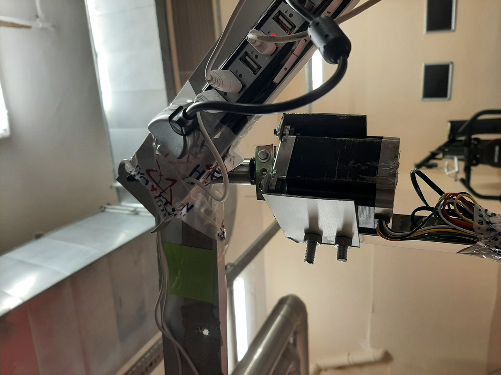
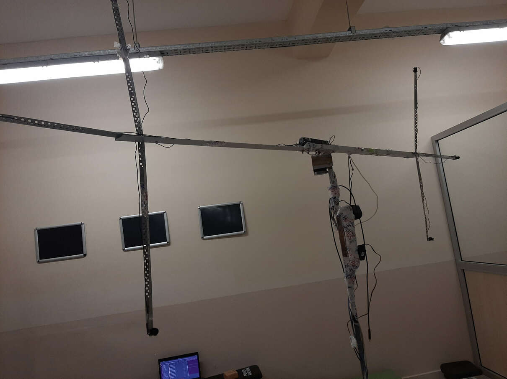
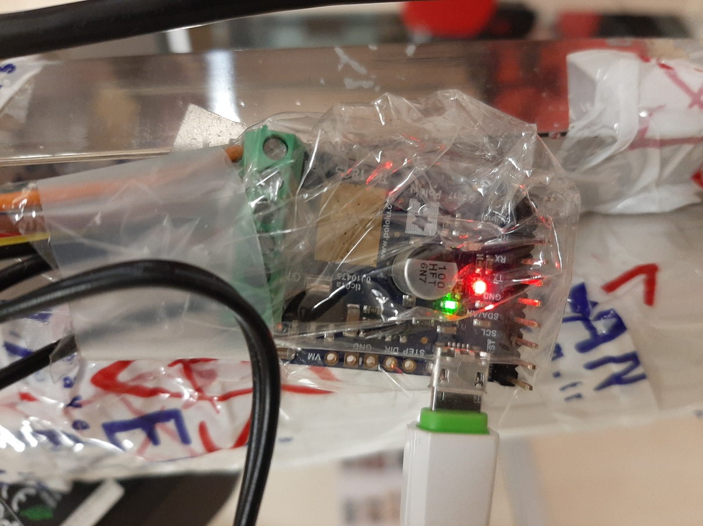

# GTU-RIR / COLLECTING REAL RIR DATA / CONSTRUCTING DEVICES / MECHANICAL

## Overview

1. You may find Sketchup Drawing File [here][sketchup] which contains 3D drawings of the stands.  
2. [Speaker Stand Construction](#01)
3. [Microphone Stand Construction](#02)

  

Mechanically we will construct 2 movable stands, one is for speakers , the other is for microphones.  

## 1. Speaker Stand Construction  

  
  
  
  

Speaker stand construction instructions :

1. Mount the NEMA step motor to one end of the steel profile ( we used , 2 parts of , 100mm length cut , aluminium L profile. )  
   1. Cut two pieces (100mm) of  aluminium L profile ( 20mm x 60mm L profile, it ia written in the Bill Of Materials)
   2. Drill each of them from 4 points, 2 for NEMA Step motor , 2 for screwing to steel profile.
   3. Mount two aluminium pieces to the NEMA step motor
   4. Drill 2 holes on the steel profile
   5. Screw the aluminium pieces to the steel profile as seen above (last drawing, left piece of aluminium is hidden , just to better see mount points ).
2. Motor Shaft Fastener : Find two pieces of metal and screw them with two bolts as shown in the last drawing above.
3. Put the steel profile on the  Office Chair Base with wheels ( just to move the stand easily)
4. Prepare the **Arms** :
   1. Take 30cm length  20mm diameter  stainless steel pipe, and cut one end of it with Angle grinder, so that the pipe may be put tightly,  into the NEMA motor's shaft fastener.    
   2. Take two 1 meter aliminium L profiles, screw it to a 30cm length , 20mm diameter , stainles steel pipe. ( Drill them before screwing )
5. Put the Arms on the NEMA motor and screw the shaft fastener.
6. Stick Logitech Z 120 speakers onto the **Arms** using duct tapes .
7. Stick Molix 10 port usb 2.0 hub onto the **Arms** using duct tapes.
8. Stick "Electric 6 Gang 10 Metre Extension Lead" onto the steel profile using duct tape.
9. Plug 5 metre usb cable to Molix usb hub and stick , stick the cable onto the steel profile using duct tape.
   1.  Be carefull while sticking the cable,  arrange the the cable so that it will not restrain the rotation of the **Arms**
  
  

At the end of the work, the speaker stand looks like the following :
   

## 2. Microphone Stand Construction 

  
  
  
  

Microphone stand construction instructions :

1. Mount the NEMA step motor to one end of the steel profile ( we used , 2 parts of , 100mm length cut , aluminium L profile. )  
   1. Cut two pieces (100mm) of  aluminium L profile ( 20mm x 60mm L profile, it ia written in the Bill Of Materials)
   2. Drill each of them from 4 points, 2 for NEMA Step motor , 2 for screwing to steel profile.
   3. Mount two aluminium pieces to the NEMA step motor
   4. Drill 2 holes on the steel profile
   5. Screw the aluminium pieces to the steel profile as seen above (last drawing, left piece of aluminium is hidden , just to better see mount points ).
2. Motor Shaft Fastener : Find two pieces of metal and screw them with two bolts as shown in the last drawing above.
3. Put the steel profile on the  Office Chair Base with wheels ( just to move the stand easily)
4. Prepare the **Arms** :
   1. Use 6 aluminium L porfiles to construct **Arms**.    
   2. Mount 4 of profiles horizontally to each other (totally making 3 meters long), and 2 of the L porfiles bir be mounted vertically as shown in the above drawings. 
5. Put the Arms on the NEMA motor and screw the shaft fastener.
6. Stick usb microphones onto the **Arms** using duct tapes .
7. Stick Molix 10 port usb 2.0 hub onto the **Arms** using duct tapes.
8. Stick "Electric 6 Gang 10 Metre Extension Lead" onto the steel profile using duct tape.
9. Plug 5 metre usb cable to Molix usb hub and stick , stick the cable onto the steel profile using duct tape.
   1.  Be carefull while sticking the cable,  arrange the the cable so that it will not restrain the rotation of the **Arms**
  
  

At the end of the work, the microphone stand looks like the following :

[sketchup]: rir-measurement-setup-1.0.2.skp

