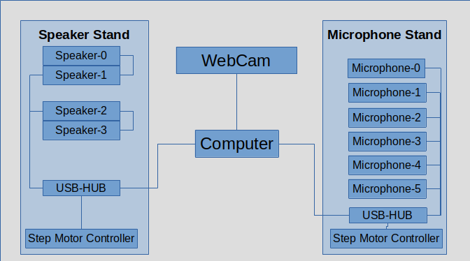
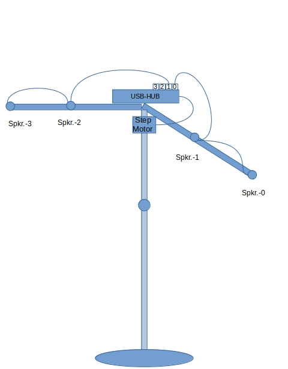
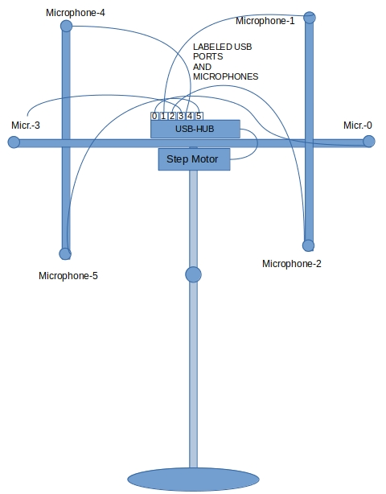

# GTU-RIR / COLLECTING REAL RIR DATA / CONSTRUCTING DEVICES / ELECTRICAL

## Overview

1. Speakers and microphones all have usb cables that will be pluged into usb hub.  
2. NEMA motor controller will be mounted to the motor and its USB cable will also be mounted to usb hub. There is a part of the controller that should be soldered. Some of controllers are sold already soldered.
3. NEMA motor electrical power adaptor is pluged into **Electrical Power Extension Lead**.
4. Usb hub also has extra power adaptor which is pluged into **Electrical Power Extension Lead**.
  

USB connection diagrams :

  

  

  

