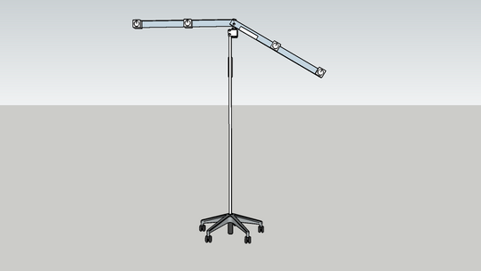
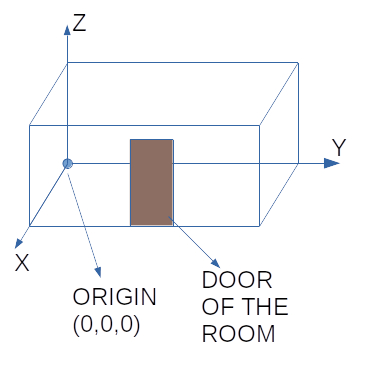
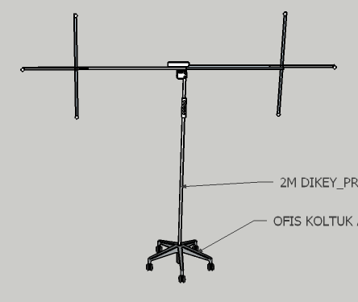

# GTU-RIR : COLLECTING REAL RIR DATA / RECORDING DATA / SETTING TO WORK

# VERY IMPORTANT NOTE : IF YOU DO ANY MISTAKE HERE, YOUR RECORDS WILL ALL BE USELESS. 
# BE VERY CAREFULL WHILE DOING THE BELOW TASKS. 
Before starting to record sound in a room, we need to prepare our recording system :

1. Stick "number stickers" on the Molix usb hubs as shown above.  
2. Stick corresponding "number stickers" on the usb microphones' connector as shown above. Both usb port on the hub, and the usb connector should be labeled with stickers because , if one of the microphones/speakers is no more functional, replacing the device should be easy.
3. Use [find_usb_mic_ports.sh](find_usb_mic_ports.sh) to find the microphone and speakers' corresponding usb port numbers. 
   1. Plug only one usb microphone to each usb port each time.
   2. The script's output is "usb_port" number, as you know also mic_no label , you fill the **usb_microphone.conf** configuration file as follows :
      >#usb_port:mic_no  
      >4:0  
      >3:1  
      >1.1:2  
      >1.4:3  
      >1.3:4  
      >1.2:5  
      >  
   3. Move the **usb_microphone.conf** into the ../02.data_recording directory.
4. Place the speaker and microphone stands in any desired position, then
   1. Check the arms of the system by turning manually. The arms should not collide with the walls or any other material in the room.
   2. Place the arms of the stands such that the "green sticker" faces "the door of the room".
5. Measure the following lengths using a measuring tape and write them to a note paper.
   1. Room Dimensions
   2. Each speakers R and Z values ( R = radius (distance from NEMA motor shaft), Z = height (distance from floor) )
   3. Each microphones R and Z values
   4. Spkeaker Stand's coordinates         
           
      1. Origin (0,0,0) is the "left most floor corner" facing the door.   
           
      2. Measure X and Y values (distance from origin in the diretion of X and Y)  
   5. Microphone Stand's cooordinates   
        
6. Place the Webcam to see both of the microphone and speaker stands. (After recording data, we will use webcam screen shots if the **Arms** are reotated correctly.)
7. Plug the usb hubs' 5 meter extension cable to the computer.
8. Plug the webcam's 5 meter usb extension cable to the computer.
9.  Plug the electricity cable coming from stands and the computer to a third **Electrical Power Extension Lead**, and plug it to the room's electicity wall-socket.
10. Install Ubuntu linux to the computer
11. Install NEMA step motor controller card's driver (TIC) from [https://www.pololu.com/docs/0J71/3.2](https://www.pololu.com/docs/0J71/3.2)
12. Install the following python libs :
    >logging  
    >tarfile  
    >csv  
    >glob  
    >sys  
    >os  
    >argparse  
    >numpy  
    >librosa  
    >time    
    >random  
    >datetime  
    >pyaudio  
    >wave  
    >threading  
    >pprint  
    >simpleaudio  
    >lywsd03mmc  
    >cv2  
    >subprocess  
    >scipy  
    >configparser  
    >math  
    >shutil  

13. **Don't forget to leave a light open (a bedside light may be enough), as the webcam will take photo for each recording step**

