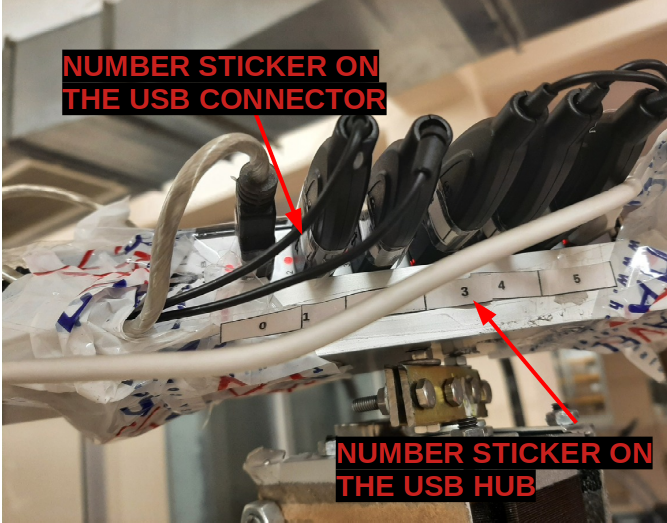

# GTU-RIR : COLLECTING REAL RIR DATA / RECORDING DATA / SETTING TO WORK

Before starting to record sound in a room, we need to prepare our recording system :

1. Stick "number stickers" on the Molix usb hubs as shown above :  
2. Stick correcponding "number stickers" on the usb microphones' connector as shown above.
3. Place the speaker and microphone stands in any desired position, then
   1. Check the arms of the system by turning manually. The arms should not collide with the walls or any other material in the room.
   2. Place the arms of the stands such that the "green sticker" faces "the door of the room".
4. Measure the following lengths using a measuring tape and write them to a note paper.
   1. Room Dimensions
   2. Each  

