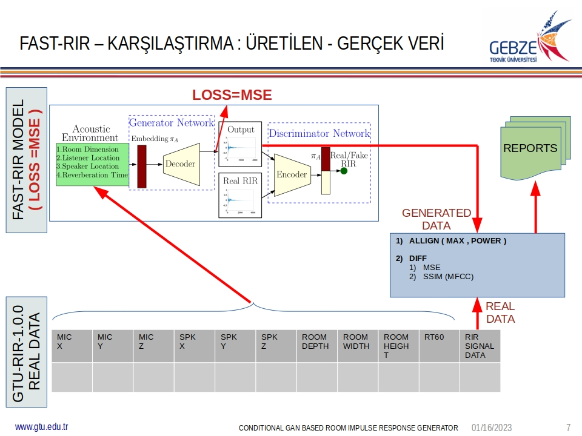
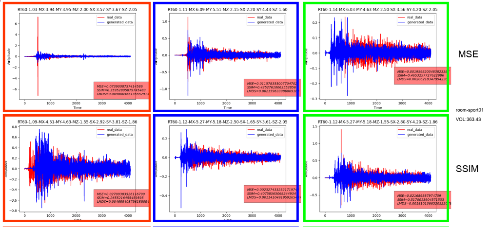

# GTU-RIR : COLLECTING REAL RIR DATA / FAST-RIR

Just run run.sh to start generating synthetic data and comparison reports.  

## The program execution flow is as follows :  

---

1. We generated synthetic data using [FAST-RIR's generative model][FAST-RIR] , by feeding microphone/speaker coordinates of collected (real) data.  
   
  
   

2. Before comparing the synthetic and the real data , we made some measurements within the real data to see if our methods are consistent  :
   MSE (Mean Sqaure Error) and SSIM(MFCC) (Structural Similarity of Mel-frequency cepstral coefficients ) 

   1.  Compare Random 1000 Data Point Pairs within Real Data :
   <table>
    <tr><th>MAX_MSE</th><th>MEAN_MSE</th><th>MIN_MSE</th><th>MSE<0.01</th><th>MAX_SSIM</th><th>MEAN_SSIM</th><th>MIN_SSIM</th><th>SSIM>0.5</th></tr>
    <tr><td>0.0168</td><td>0.0043</td><td>0.0003</td><td>968</td><td>0.7693</td><td>0.3914</td><td>0.0568</td><td>311</td></tr>
   </table>

   2.  Compare Random 500 Data Point Pairs within the Same Room in the Real Data :

2.0 COMPARE - RANDOM 500  DATA POINT PAIRS - REAL DATA - SAME ROOM:
-------------------------------------------------------------------------------
SUMMARY TABLE :
                ROOM		VOLUME		MAX_MSE		MEAN_MSE	MIN_MSE		MSE<0.01	MAX_SSIM	MEAN_SSIM	MIN_SSIM	SSIM>0.5
            room-207		172.8660		0.0073		0.0025		0.0004		500		0.6984		0.4672		0.1133		213
            room-208		146.1032		0.0117		0.0049		0.0010		492		0.7213		0.5249		0.1468		340
  room-conferrence01		209.7450		0.0060		0.0028		0.0006		500		0.5999		0.3832		0.1595		22
        room-sport01		363.4330		0.0082		0.0018		0.0003		500		0.7596		0.5685		0.2935		382
        room-sport02		160.1842		0.0096		0.0036		0.0005		500		0.7175		0.4368		0.0743		187
            room-z02		139.7839		0.0176		0.0078		0.0016		382		0.7807		0.6412		0.2026		456
            room-z04		139.9681		0.0182		0.0080		0.0019		375		0.7779		0.6287		0.1674		448
            room-z06		326.5284		0.0109		0.0046		0.0009		496		0.7676		0.6021		0.1965		443
            room-z10		328.6192		0.0083		0.0038		0.0008		500		0.7456		0.5819		0.2314		413
            room-z11		204.6330		0.0120		0.0055		0.0013		487		0.7425		0.5901		0.1588		423
            room-z23		410.2050		0.0026		0.0012		0.0000		500		1.0000		0.4960		0.1720		268

3.0 COMPARE - RANDOM 100 DATA POINT PAIRS - REAL DATA - ANY ROOM - SIMILAR SPEAKER COORDINATES:
---------------------------------------------------------------------------------------------------
SUMMARY TABLE :
   TOTAL DATA POINTS		VOLUME		MAX_MSE		MEAN_MSE	MIN_MSE		MSE<0.01	MAX_SSIM	MEAN_SSIM	MIN_SSIM	SSIM>0.5

               15202		0.00		0.0204		0.0035		0.0000		14433		1.0000		0.5912		0.0000		10952

4.0 COMPARE - RANDOM 100 DATA POINT PAIRS - GENERATED DATA - ANY ROOM - SIMILAR SPEAKER COORDINATES:
---------------------------------------------------------------------------------------------------
SUMMARY TABLE :
   TOTAL DATA POINTS		VOLUME		MAX_MSE		MEAN_MSE	MIN_MSE		MSE<0.01	MAX_SSIM	MEAN_SSIM	MIN_SSIM	SSIM>0.5
               15152		0.00		0.0119		0.0016		0.0000		15150		1.0000		0.9026		0.0000		15148

1. We evaluated also [FAST-RIR][FAST-RIR] generated data by measuring MSE and SSIM(MFCC))

1.1 COMPARE - RANDOM 1000  DATA POINT PAIRS - GENERATED DATA :
------------------------------------------------------------------------
SUMMARY TABLE :
                ROOM		VOLUME		MAX_MSE		MEAN_MSE	MIN_MSE		MSE<0.01	MAX_SSIM	MEAN_SSIM	MIN_SSIM	SSIM>0.5
            ANY ROOM		0.0000		0.0116		0.0040		0.0001		992		0.9993		0.7283		0.4483		994

2.1 COMPARE - RANDOM 500  DATA POINT PAIRS - GENERATED DATA - SAME ROOM :
-------------------------------------------------------------------------------------
SUMMARY TABLE :
                ROOM		VOLUME		MAX_MSE		MEAN_MSE	MIN_MSE		MSE<0.01	MAX_SSIM	MEAN_SSIM	MIN_SSIM	SSIM>0.5
            room-207		172.8660		0.0065		0.0018		0.0001		500		0.9721		0.7668		0.4714		499
            room-208		146.1032		0.0063		0.0026		0.0002		500		0.9961		0.9514		0.7765		500
  room-conferrence01		209.7450		0.0072		0.0027		0.0000		500		1.0000		0.7579		0.5690		500
        room-sport01		363.4330		0.0039		0.0009		0.0001		500		0.9942		0.9319		0.8026		500
        room-sport02		160.1842		0.0089		0.0036		0.0000		500		1.0000		0.9553		0.7849		500
            room-z02		139.7839		0.0064		0.0017		0.0001		500		0.9956		0.9524		0.7548		500
            room-z04		139.9681		0.0052		0.0019		0.0000		500		1.0000		0.9518		0.8101		500
            room-z06		326.5284		0.0043		0.0009		0.0000		500		1.0000		0.8612		0.5954		500
            room-z10		328.6192		0.0084		0.0026		0.0000		500		0.9992		0.8322		0.5044		500
            room-z11		204.6330		0.0057		0.0020		0.0002		500		0.9934		0.9576		0.8089		500
            room-z23		410.2050		0.0048		0.0007		0.0000		500		0.9937		0.8793		0.5407		500

3.1 COMPARE - RANDOM 100 DATA POINT PAIRS - REAL DATA - ANY ROOM - SIMILAR MICROPHONE COORDINATES:
---------------------------------------------------------------------------------------------------
SUMMARY TABLE :
   TOTAL DATA POINTS		VOLUME		MAX_MSE		MEAN_MSE	MIN_MSE		MSE<0.01	MAX_SSIM	MEAN_SSIM	MIN_SSIM	SSIM>0.5
               15202		0.00		0.0210		0.0025		0.0000		14174		1.0000		0.3436		0.0000		10955

4.1 COMPARE - RANDOM 100 DATA POINT PAIRS - GENERATED DATA - ANY ROOM - SIMILAR MICROPHONE COORDINATES:
---------------------------------------------------------------------------------------------------
SUMMARY TABLE :
   TOTAL DATA POINTS		VOLUME		MAX_MSE		MEAN_MSE	MIN_MSE		MSE<0.01	MAX_SSIM	MEAN_SSIM	MIN_SSIM	SSIM>0.5
               15143		0.00		0.0110		0.0006		0.0000		15142		1.0000		0.5500		0.0000		15139

4. We compared our data with [FAST-RIR][FAST-RIR] model output.

5.1 COMPARE - GENERATED DATA - REAL DATA :
-------------------------------------------------------------------------------
SUMMARY TABLE :
        ROOM		VOLUME		MAX_MSE		MEAN_MSE	MIN_MSE		MSE<0.01	MAX_SSIM	MEAN_SSIM	MIN_SSIM	SSIM>0.5
    room-207		172.87		0.0363		0.0116		0.0029		683		0.3508		0.2078		0.0724		0
    room-208		146.10		0.0629		0.0216		0.0058		334		0.3691		0.2438		0.1232		0
room-conferr		209.75		0.0344		0.0130		0.0041		538		0.3727		0.2422		0.0834		0
room-sport01		363.43		0.0647		0.0078		0.0023		1183		0.4068		0.1873		-0.0052		0
room-sport02		160.18		0.0516		0.0188		0.0033		321		0.3907		0.2379		0.0253		0
    room-z02		139.78		0.0843		0.0324		0.0084		24		0.4038		0.2856		0.1340		0
    room-z04		139.97		0.0837		0.0324		0.0086		22		0.4034		0.2955		0.1514		0
    room-z06		326.53		0.0642		0.0187		0.0047		448		0.3468		0.1883		0.0625		0
    room-z10		328.62		0.0457		0.0174		0.0050		436		0.3581		0.2277		0.1064		0
    room-z11		204.63		0.0590		0.0229		0.0062		140		0.3520		0.2461		0.1113		0
    room-z23		410.21		0.0163		0.0057		0.0018		1030		0.2684		0.1049		-0.0058		0

--------------
TODO :

1. screen shots from last presentation odp (4. donem)
2. FAST-RIR link + FAST-RIR page from last odp
3. How fast rir is used to generate data (last odp)
4. Which reports are generated
   1. Method evaluator reports (link example table link)
   2. Diff Report for each room (put an example table)
   3. Summary Reports for each room ( link example summaries )
      Put an example summary image here from last odp.
5. What we tried also (SSIM loss)
   1. Put an example report table
   2. put an example summary image.
   
[FAST-RIR]:https://github.com/anton-jeran/FAST-RIR